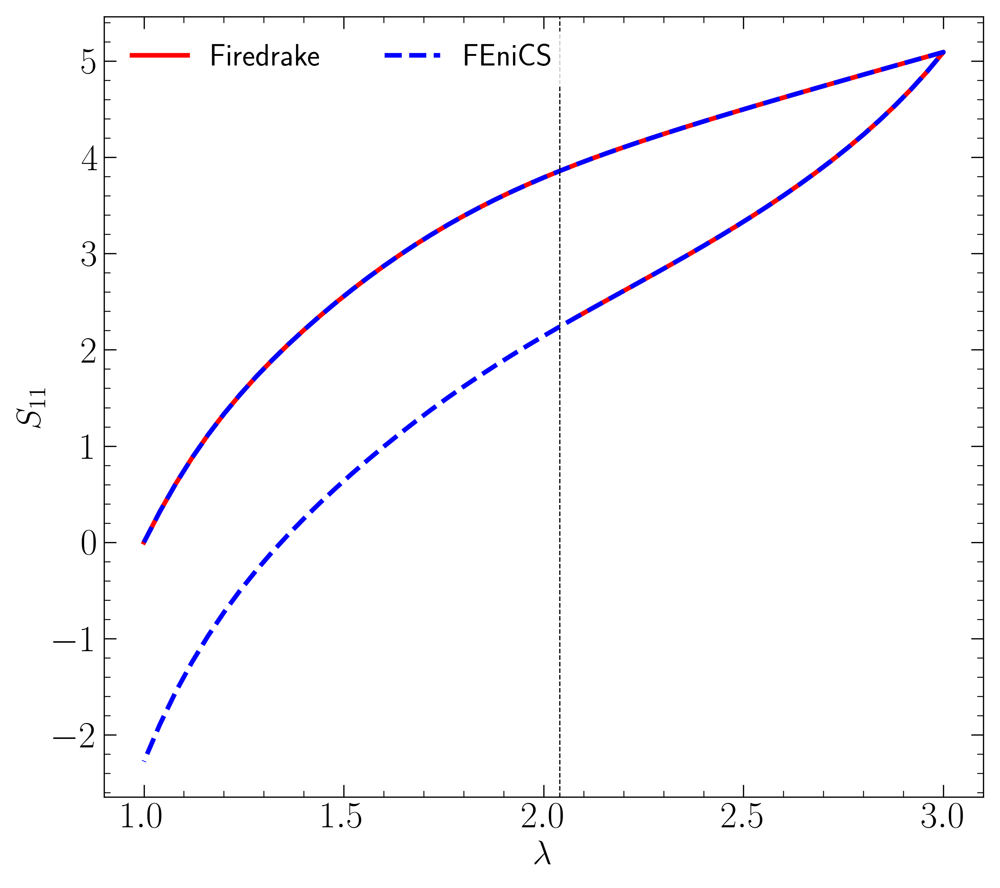

# comparingFiredrakeFEniCS
This repository contains two scripts `viscoelasticity_taylor_hood.py` and `viscoelasticity_th_fenics.py` that each implements
a rubber-viscoelastic model for an incompressible solid. This is an attempt at better understanding Firedrake -- especially
the solver parameters passed to `PETSc`'s SNES solver.

### Comparison for a uniaxial loading

